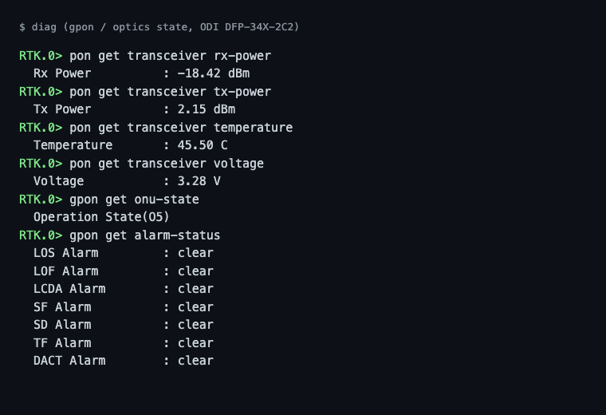

# odi-oss

Open firmware for the **ODI DFP-34X-2C2** GPON SFP ONU stick (Realtek
RTL9602C SoC, Lexra RLX5281 CPU, 32 MB RAM, 8 MB NOR flash), built from
source: a current mainline Linux kernel, our own userland, and our own
toolchain.

> [!WARNING]
> **For the ODI DFP-34X-2C2 only** (see "Supported hardware").
>
> **This repository was written with AI assistance ("vibecoded") and
> validated on real hardware, with no warranty of any kind.** Flashing a
> stick with the wrong image, or interrupting a flash, can brick the stick
> or take down the fiber (GPON) service it is carrying. Read "Safety model"
> below and "Quick start" before you flash anything, and never flash a
> stick that is your only connection to the Internet without a way back.

## Supported hardware

**Only the ODI DFP-34X-2C2.** It is the one device this firmware was written
for and the only one it has been tested on. The image drives the board
directly (GPIO numbers, I2C wiring of the optics, flash layout, switch and
PON registers), so on any other stick it will at best not boot and at worst
leave it unreachable.

- **DFP-34X-2C3:** as far as we know it differs from the 2C2 only in the
  polish of the fiber connector: the 2C2 is SC/UPC (blue), the 2C3 SC/APC
  (green). The electronics should be the same, so the image should
  work, but it has **never been tried on a 2C3**. If you do, you are the
  first; please report the result.
- **Anything else** (other ODI models, other RTL9601/RTL9602C sticks,
  rebrands with a different board): not supported, even with the same SoC.

## Safety model

This firmware is meant to be flashed **into the slot the stick is not
currently running from**, and booted **once, on trial**, before it is ever
made permanent:

- The stick has **two boot slots** (kernel + rootfs pairs). You always flash
  the slot you are *not* running, so the working image — normally the stock
  (OEM) firmware — stays untouched in the other slot the whole time.
- A newly flashed slot is **inert** until you tell the bootloader to try it:
  `nv setenv sw_tryactive <slot>` boots that slot **exactly once**, with the
  hardware watchdog armed. If the new image does not come up — kernel panic,
  no root filesystem, `init` never starting — the watchdog resets the board
  and the bootloader falls back to the slot it already trusts. Nothing is
  lost, and nothing needs to be done by hand.
- **Commit a trial yourself, once you have watched it work.** Making a slot
  permanent (`sw_commit`) throws that safety net away: a committed image
  that later crashes reboots into itself, with no way back to the other
  slot. `nv commit <slot>`, run on the trial, writes both copies of the boot
  environment and reads each back. Until you do, the image says it is a
  trial: at every ssh login, and as `gpon_uncommitted` on the exporter. The full
  procedure, including recovery if something still goes wrong, is in
  [`docs/FLASHING.md`](docs/FLASHING.md).

## What this is

The device shipped with a closed firmware image running Linux 2.6.30. This
repository is not a repack of that image: it builds a complete replacement
firmware from source — kernel, userland tools, daemons and toolchain — for
the same hardware.

| area | stock (OEM) firmware | this firmware |
|---|---|---|
| source | closed | fully open: mainline Linux + our own drivers and userland, all built from source, no proprietary code shipped or linked |
| kernel | Linux 2.6.30 | Linux 6.18.53 (current LTS), carried as 19 changed lines in 6 mainline files plus our own overlay, so the next LTS port is cheap |
| switch / GPON MAC driver | closed | our own GPL driver, an independent implementation, built straight into the kernel |
| GPON/OMCI daemon | closed | our own `omcid`, with `omcli`/`omcicli`, `omciprobe` and `omcicap` tooling around it |
| switch/optics CLI (`diag`) | closed; some commands crash or hang the CLI | our own CLI over our kernel's interfaces: optics, GPON state, alarms and flows, port MIB counters, the MAC table, register access; batches commands and always exits cleanly; the exporter's commands are byte-compatible with the stock CLI |
| optics (DDM) readout | closed | our own SFF-8472 reader, exposed through `diag`: temperature, voltage, bias current, tx/rx power, plus alarm/warning flags and optical LOS status (`pon get transceiver alarm-status`) |
| multicast | closed IGMP handling | IGMP snooping is off (not used: one UNI port leaves little to prune). `igmpd` ships but is not started (see [`docs/TOOLS.md`](docs/TOOLS.md)) |
| system log | none: no syslogd, nowhere central to read a log from | `syslogd`/`klogd`, a 64 KB circular buffer `logread` reads, optional remote forwarding (`SYSLOG_SERVER`); one greppable `event=` line per link or provisioning event -- every ONU state change with the state it left, how long it was there and whether the OLT, a timer, the fibre or this side caused it; OLT MIB resets, uploads, provisioning bursts (N creates/sets), reboot and software-download requests; every managed entity class or message type the OLT sends that omcid does not model, once per boot and counted in `/var/log/omcid-unknown.txt` (the ISP1 OLT sends three); omcid resuming or re-registering -- so the log says who started an outage (`docs/TOOLS.md`, "Link and provisioning events") |
| software download from the OLT | flashes the ISP image into the other slot and reboots into it, on the OLT command | never flashes and never reboots: the download is answered (G.988 windows, the image CRC-32 checked) and the image discarded, and the software image entity reports it activated and committed so the OLT is satisfied; `OLT_SW_DOWNLOAD=reject` refuses it instead (`docs/SETTINGS.md`). Tested under qemu, with a syscall trace showing no flash, no exec and no reboot |
| clock | none: no RTC, no NTP client | opt-in `ntpd` (`NTP_SERVER`) |
| web UI | closed, minimal | `confd` (a separate project): same port; offers only the 21 settings this image reads, each marked LIVE, SERVICE RESTART, INTERRUPTS INTERNET or REBOOT, and applies them without a reboot where it can; the switch MAC table; firmware upload and write to the inactive slot; SSH-key management; build/version info |
| metrics | none | a Prometheus exporter, `metricsd` (a separate project), including whether the OLT actually provisioned service, not just link state |
| SSH | an old dropbear needing legacy algorithms re-enabled on the client | a current dropbear, ed25519 host key, `scp` in both directions |
| login security | telnet enabled by default, and a fixed, well-known default login (`admin`/`admin`) | no telnet; ssh only. A release image ships with root locked (keys only, no password); a source build defaults to a password generated per build and stored as a SHA-512 crypt hash. Either way, the web UI's own `admin`/`admin` default must still be changed by the operator |
| memory | about 1.1 MB free after a cache drop, with the stock services running | about 15 MB available: our drivers load the switch and GPON register tables from firmware files, apply them and free them |
| kernel size | fits its partition with little to spare | about 83 KB spare (1,274,429 of 1,359,872 bytes), after cutting kernel features nothing on the stick uses and the driver bring-up scaffolding |
| reboot | not measured | `reboot` resets at once through a watchdog restart handler; back in the stock image about 73 s later |
| toolchain | a decade-old vendor cross-compiler | our own gcc / binutils / uClibc-ng, built from source, targeting the CPU's actual instruction set; published as prebuilt container images pinned by digest, so a build pulls the toolchain instead of compiling it for an hour: a clean image build takes about 3.5 minutes on a native 8-core host (building the toolchain from source is still one command) |
| boot safety | undocumented | one-shot trial boot (`sw_tryactive`) plus a watchdog the kernel alone owns and enforces (`docs/SETTINGS.md`, "Watchdog rules"): it self-reverts a boot whose userland never confirms, a registered daemon (omcid) that stops pinging its own deadline, or `MemAvailable` held below a floor -- boot confirmation does not depend on the network. Every rule is host-tested against a fake clock (`test/odi_wdt_test.c`); the reset itself needs hardware to verify, not yet run on this redesign |
| committing a trial | by hand (`nv setenv sw_commit`), no sign that a boot is a trial | by hand with `nv commit <slot>`: both environment copies, in a power-cut-safe order, each read back, refusing any slot that is not the running one (host-tested against a fake flash that fails at every step, `src/nv/test/test_commit.c`); an uncommitted image says so at every ssh login and as `gpon_uncommitted` / `gpon_committed_slot` on the exporter, from `/var/run/odi-slot` |
| boot reliability | not a concern of the stock image | two bootloader leftovers found and fixed: NIC DMA still running into memory the kernel reuses (stopped first thing at boot), and an instruction cache that does not see new code (invalidated whenever a page can run); release images boot 15 of 15 in a row |
| boot debugging | none (no serial console) | every console line mirrored into DRAM that survives a watchdog reset; the next boot of this image shows the failed one in `/proc/odi_ramlog_prev`, with fatal-signal register dumps and early-boot crumbs |
| memory pressure (OOM) | a 20 MB scp into `/tmp` (unbounded ramfs) took `MemAvailable` to 0.86 MB and the OOM killer took dropbear, confd and omcid, none of them restarted, unmanageable until a power cycle -- reproduced on ISP1, 2026-09-27 | `/tmp` and `/var` are size-capped tmpfs (8 MB / 6 MB, `docs/SETTINGS.md`), so a full `/tmp` gives ENOSPC instead of taking down the box; `oom_score_adj` biases the OOM killer away from omcid/dropbear/confd; the four critical daemons restart the instant they die, as `/etc/inittab` `respawn` entries busybox init forks and tracks itself, not a hand-rolled supervisor loop; the kernel itself resets the board if `MemAvailable` stays below a floor for several consecutive checks, in addition to (not instead of) the omcid own ping deadline -- a first version of the second check (v1.0.2, a separate userland process) shipped and was withdrawn the same day for withholding its kick with nothing kernel-side enforcing it, so a hang it correctly saw still never reset the board |
| testing | none published | host tests of the drivers against a register model, the OMCI daemon replayed under qemu against captures from two ISPs, golden tests of the exporter-facing CLI output, of the whole boot register stream, of every command and `/proc` write the boot script makes, and of the driver calls of an OMCI session per ISP; `make test-qemu` boots the real rootfs (busybox, inittab, services, dropbear, confd, metricsd) under `qemu-system-mips -M malta` on a stock kernel and checks ssh/web UI/exporter plus the resilience scenarios above end to end; CI on every change |
| diagnostics | none | one-click bundle from the web UI (Admin) or `/etc/scripts/diag-bundle.sh`: logs, the previous boot ramlog, dmesg, slot variables from both environment copies, an exporter scrape and the config, every password redacted by key and then scrubbed from every file as text and hex; `make test-qemu` plants secrets and asserts none reaches the bundle (`docs/TOOLS.md`) |
| config backup | a manual download from the vendor UI | `tools/config-backup.sh` pulls the same backup from a host on a schedule (cron or a systemd timer), keeps a dated copy only when a setting changed and the last 30, and exits non-zero when it could not (`docs/SETTINGS.md`) |
| documentation | none | build, flashing and recovery, every setting and toggle, the boot stage by stage (`docs/BOOT.md`), the kernel port, a contributor guide (`docs/HACKING.md`) |

Every row above is backed by something you can read or run in this repo:
[`docs/IMPROVEMENTS.md`](docs/IMPROVEMENTS.md) has the detail and the
verification for each one.

## Screenshots

| Web UI ([odi-ui](https://github.com/AndreZiviani/odi-ui)) | `diag` on the stick |
|---|---|
|  |  |

Identifiers in the screenshots are placeholders. More pages in the
[odi-ui README](https://github.com/AndreZiviani/odi-ui#screenshots).

## Quick start

**Get an image**, either a published release or your own build:

- **Release** (recommended if you are not changing the code): download
  `<version>.tar` and `SHA256SUMS` from
  [Releases](https://github.com/AndreZiviani/odi-oss/releases), and check
  the tarball against the checksum file before flashing anything. Release
  images ship keys-only — see "First login" below.
- **Build** (needs Docker; see [`docs/BUILDING.md`](docs/BUILDING.md) for the
  full breakdown and remote-build option):

      make image-all      # pulls the toolchain; kernel, packages, our tools, the image
      make image          # just the tarball, out/image/<version>.tar, once the pieces above exist

  A source build defaults to a random per-build root password
  (`ROOT_PW=locked` builds the same keys-only image the releases ship).

**Flash**, into the slot you are not running, and trial-boot it — commit
it with `nv commit <slot>` only once you have checked it yourself. Full procedure, including how to read a boot you
could not otherwise see: [`docs/FLASHING.md`](docs/FLASHING.md).

**First login**, once the trial image is up:

- **Release image, or a source build with `ROOT_PW=locked`**: root has no
  password at all (ssh with a password is refused). Open the web UI on
  port 80 — `admin`/`admin` until you change it — and add your SSH public
  key under its SSH-key admin page; `ssh root@<stick>` with that key then
  works, and keeps working across reboots and re-flashes (the key lives on
  the config partition, not in the image).
- **A default source build**: ssh as `root` with the password
  `image/build.sh` generated for that build
  (`out/image/root-password-<version>.txt`), or the web UI the same way as
  above. Add your own SSH key from there; the root password stays valid
  beside it.

Either way, change the web UI's own default credential first — it is what a
freshly reset or freshly flashed stick answers to. Full detail, including
every port and how to move files on and off the stick:
[`docs/ACCESS.md`](docs/ACCESS.md).

## Status and limitations

**Tested on real sticks.** The current release,
`odi-oss-260925-618z1` ([`CHANGELOG.md`](CHANGELOG.md)), runs on two
DFP-34X-2C2 sticks on two different ISPs' GPON networks:

- **ISP1**: 15 of 15 consecutive trial boots reached a confirmed userland
  (75-81 s from `reboot`), then a 3-hour soak with a sample every 10
  minutes came out clean: ONU state O5 throughout, every data round trip
  through the stick's own NIC checksummed correctly, no receive or transmit
  errors, no kernel errors, flat free memory.
- **ISP2**: carrying a household's Internet link (PPPoE through the stick,
  about 52 MB/s on a 20 MB download, the same as the image before it).

Both run it as a one-shot trial over the stock firmware, which stays the
committed slot on each; neither has had this image committed.

This is new, actively developed firmware. Before relying on it:

- It targets exactly one board: the ODI DFP-34X-2C2 / RTL9602C. It is not a
  general MIPS or GPON-ONU firmware.
- `diag` is not the stock CLI: it carries only the commands our kernel can
  answer (`diag help` lists them). The handful the Prometheus exporter uses
  keep the stock syntax and output, so the exporter reads either firmware.
- IGMP snooping is off. `igmpd` ships but nothing starts it, and its switch
  writes fail on the 6.18 kernel; our kernel does not deliver IGMP frames to
  it either (the OMCI transport passes only OMCI frames up). The stick does
  not prune multicast.
- The config store is shared with the stock firmware: of its 184 keys this
  image reads 21, and the UI shows the other 163 read-only.
  [`docs/SETTINGS.md`](docs/SETTINGS.md) has each one and what applying it
  costs.
- The watchdog is armed on every boot: if the kernel hangs or the boot
  scripts never finish within 120 s, the board resets (a trial falls back
  to the committed slot). A stick that boots but is unreachable is not
  reset; power-cycle it. See [`docs/FLASHING.md`](docs/FLASHING.md).
- Builds are not bit-reproducible: the kernel and the image manifest embed
  build time, so two builds of the same tree are equivalent, not identical.
- There is no serial console on this device. If a trial boot goes wrong and
  you cannot reach the stick, `docs/FLASHING.md` covers what to do (and what
  it does not); a hardware UART is the last resort, and the point of the
  trial-boot safety model above is to make that resort as rare as possible.

## Documentation

- [`docs/KERNEL.md`](docs/KERNEL.md) — the 6.18 kernel port: CPU, board, boot,
  the config, our drivers, the ramlog, how to build and check it.
- [`docs/TOOLS.md`](docs/TOOLS.md) — every CLI and daemon: what it does, how
  to run and restart it, what it reads, where it logs, who starts it.
- [`docs/SETTINGS.md`](docs/SETTINGS.md) — every setting the web UI and the
  config partition offer: which ones this image actually uses, and which
  need a reboot or interrupt the internet connection.
- [`docs/BUILDING.md`](docs/BUILDING.md) — building the whole image, piece by
  piece, locally or on a remote build host.
- [`docs/FLASHING.md`](docs/FLASHING.md) — the trial-boot procedure and
  recovery.
- [`docs/ACCESS.md`](docs/ACCESS.md) — ports, the web UI, SSH keys, moving
  files on and off the stick.
- [`docs/CROSS-COMPILING.md`](docs/CROSS-COMPILING.md) — compiling your own C
  for this CPU, freestanding or against our libc.
- [`docs/IMPROVEMENTS.md`](docs/IMPROVEMENTS.md) — the improvements table
  above, expanded, with what backs each claim.
- [`docs/LICENSING.md`](docs/LICENSING.md) — what license covers what in this
  tree.
- [`docs/REFERENCES.md`](docs/REFERENCES.md) — the public specifications the
  GPON code is written against, and how to fetch them.
- [`CHANGELOG.md`](CHANGELOG.md) — what each release changed.
- [`docs/kb/README.md`](docs/kb/README.md) — field notes on the device and the
  stock firmware's behaviour, from reverse-engineering real sticks.
- [`docs/HACKING.md`](docs/HACKING.md) — the contributor guide: layout, the
  build, the recovery mechanism in full, testing, the known traps, and every
  feature toggle, for a developer who wants to change this firmware.
- [`CONTRIBUTING.md`](CONTRIBUTING.md) — scope, reporting issues, the gates.
- [`AGENTS.md`](AGENTS.md) — repo layout, build/test commands and house rules,
  for anyone (human or AI) working on this codebase.

## License

Our own code (kernel patches and drivers, `src/`, the rootfs skeleton and the
build scripts) is GPL-2.0-or-later; see [`LICENSE`](LICENSE). The kernel
itself stays GPL-2.0-only, as upstream ships it — our patches and drivers
are GPL-2.0-or-later, combined into a GPL-2.0 kernel, which GPL-2.0-or-later
permits.
The toolchain and every upstream package it builds (busybox, dropbear,
iproute2) keep their own upstream licenses. See
[`docs/LICENSING.md`](docs/LICENSING.md) for the full breakdown.

## Related repositories

- [odi-ui](https://github.com/AndreZiviani/odi-ui) — the web UI, `confd`.
- [odi-sfp-exporter](https://github.com/AndreZiviani/odi-sfp-exporter) — the
  Prometheus exporter, `metricsd`.
- [odi-toolchain](https://github.com/AndreZiviani/odi-toolchain) — the
  prebuilt build images shared by all three.
